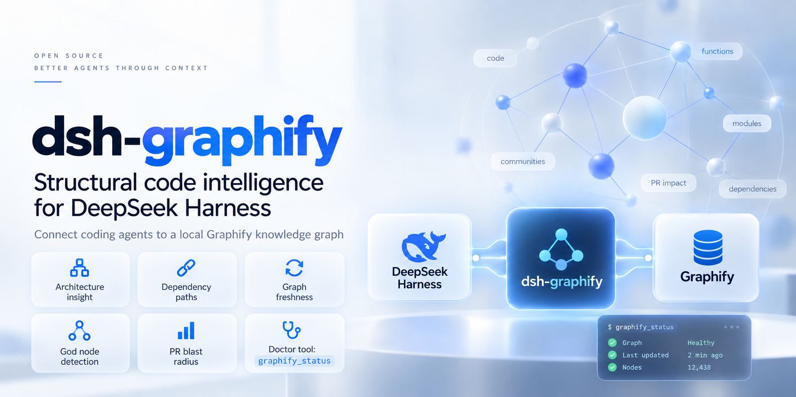

# dsh-graphify

> Give DeepSeek Harness a current, local map of your codebase.

`dsh-graphify` connects [Graphify](https://github.com/Graphify-Labs/graphify)'s code knowledge graph to DeepSeek Harness (DSH). It helps an agent move from a question to the relevant symbols, dependencies, architectural communities, and change impact without treating a repository as an unstructured pile of files.



## Why use it?

Graphify is the local graph engine; `dsh-graphify` is the DSH-native layer that makes it practical in an agent session.

| With a raw code search workflow | With dsh-graphify |
| --- | --- |
| The agent repeatedly guesses paths, greps, and reads broad files. | The agent can start from symbols, dependency paths, communities, and graph-backed project context. |
| A graph can silently describe an older checkout. | Freshness checks identify stale graphs and can warn or safely run an incremental code update. |
| Every graph capability is exposed, even when a smaller model needs only navigation. | Compact mode provides six focused tools for local 20B–30B models; full mode exposes the complete set. |
| MCP setup and failures are separate from the DSH session. | The plugin resolves the active session project, manages the Graphify process, and provides `graphify_status` for diagnosis. |

This is not a claim that a graph replaces source reading or tests. It gives the agent a reliable starting map, so it can spend its context budget on the code that matters.

## Install and use it

### Before you start

You need a working DSH profile, Node.js 22.18 or later, Python 3.10 or later, and [`uv`](https://docs.astral.sh/uv/). The plugin is tested on macOS and Ubuntu Linux; Windows is not yet verified.

### 1. Add the plugin to your DSH profile

```sh
dsh plugin --profile <profile> add dsh-graphify
```

For example, replace `<profile>` with the profile you normally use to run DSH. The bundle activates itself; you do not need to hand-edit a Cordis configuration for the default setup.

### 2. Install the local Graphify runtime

```sh
uv tool install 'graphifyy[mcp]==0.9.57'
```

If Graphify is unavailable, DSH can still start. Ask for `graphify_status` after installing it; the plugin discovers the runtime on the next check or tool call, without a DSH restart.

### 3. Build a graph for a repository

Start DSH from the repository you want to explore:

```sh
cd /path/to/your/repository
dsh --profile <profile>
```

Then, in the DSH conversation, run:

```text
/graphify
```

The command performs a full build and writes `graphify-out/graph.json` in that repository. Check the result with:

```text
graphify_status
```

### 4. Ask architectural questions

Try requests that benefit from relationships instead of filename matching:

```text
What are this repository's entry points and the most connected modules?
```

```text
Before I change this interface, show the dependency path to its callers and summarize the likely blast radius.
```

```text
Which community owns authentication, and where does it connect to the API layer?
```

## Pick a mode

The default `full` mode exposes the complete Graphify capability set, including communities, god nodes, and pull-request impact. Use it when your model has ample tool-selection capacity or you need those specialist queries.

For local 20B–30B models, use `compact`. It registers six high-frequency tools: status, graph query, node inspection, neighbours, shortest path, and the session-scoped graph resource. Fewer choices help smaller models use the graph consistently.

Add an override only when you need one:

```yaml
- insert:
    - id: dsh-graphify
      name: dsh-graphify
      config:
        toolMode: compact
        freshness:
          mode: warn
```

`freshness.mode` is `warn` by default. Choose `auto` when you want the plugin to coalesce safe incremental updates before a query; choose `off` only when you deliberately accept a static graph. A full `/graphify` build is required after documentation or other non-code changes, because incremental Graphify updates cover code extraction only.

## What the plugin adds

- **Session-aware project resolution:** graph requests follow the active DSH workspace. Model-invoked access outside that workspace is blocked by default.
- **Freshness you can inspect:** `graphify_status` reports the resolved project, graph path, runtime availability, connection state, and whether the graph matches the indexed source state.
- **Safe update policy:** incremental updates run only for changes the plugin can prove are code-only; otherwise it keeps the graph marked stale and asks for a full build.
- **DSH-native operation:** `/graphify` builds or updates the receiving session's project and shows its durable result in DSH Web.
- **Resilient local runtime:** the plugin discovers Graphify automatically and reconnects after unexpected MCP-process exits.

## Common tasks

| Goal | In DSH |
| --- | --- |
| Build or fully refresh the graph | `/graphify` or `/graphify build` |
| Update changed code files | `/graphify update` |
| Diagnose installation, project selection, or stale data | `graphify_status` |
| Find a symbol and related architecture | Ask the agent to query the graph, then inspect the returned nodes and paths. |
| Analyse a risky change | Ask for dependents, shortest paths, communities, or PR impact before editing. |

`/graphify update` is intentionally conservative. Run `/graphify` after changes to Markdown, package metadata, configuration, or any other non-code source that should be represented in the graph.

## Configuration reference

The defaults work for most single-repository sessions. These are the settings users commonly change:

| Setting | Default | Use it when |
| --- | --- | --- |
| `toolMode` | `full` | Set `compact` for focused navigation with smaller local models. |
| `freshness.mode` | `warn` | Set `auto` for safe pre-query code updates, or `off` for an intentionally static graph. |
| `graphifyVersion` | unset | Pin the Graphify version used by automatic `uv` fallback. |
| `graphPath` | auto-detected | Point to a non-standard `graph.json` location. |
| `cwd` | active session project | Supply a fallback project directory when a session has no workspace. |
| `allowExternalProjects` | `false` | Allow model tools to access projects beyond the session workspace. |
| `toolPrefix` | empty | Avoid tool-name collisions in a larger DSH profile. |

See [`src/config.ts`](src/config.ts) for the complete, typed configuration schema and defaults.

## Troubleshooting

| Symptom | What to do |
| --- | --- |
| `graphify_status` says the runtime is unavailable | Run the `uv tool install` command above, then run `graphify_status` again. |
| No graph is found | Start DSH in the repository and run `/graphify`. |
| The graph is stale after docs or configuration edits | Run `/graphify` for a full build. |
| The wrong project is selected | Start DSH from the intended repository, or configure `cwd` or `graphPath`. |
| A model needs another checkout | Keep the default isolation where possible; otherwise set `allowExternalProjects: true` deliberately. |

## Compatibility and development

The package supports `@deepseek-ai/cordis` `>=4.0.0 <5` and is tested with Graphify `0.9.57`. It ships a prebuilt DSH bundle and can be developed locally with:

```sh
pnpm run typecheck
pnpm run build
pnpm test
pnpm run test:drift
```

Use `GRAPHIFY_E2E=1 pnpm run test:e2e` to exercise a live local Graphify installation. Contribution guidance is in [CONTRIBUTING.md](CONTRIBUTING.md).

## Evidence and next steps

[BENCHMARK.md](BENCHMARK.md) defines the planned, reproducible evaluation of Graphify-assisted agents against the baseline. It is an experimental protocol, not performance results. For Graphify's graph engine, supported languages, and upstream CLI documentation, visit [Graphify](https://github.com/Graphify-Labs/graphify).
